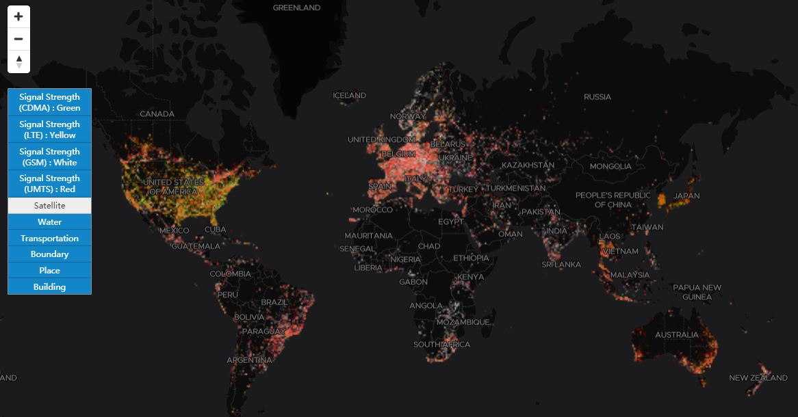

# CSSMap
Interactive Visualization of Cellular Signal Strength on the Planet.

## Setting

***Tab1. Datasets: Base stations in the dataset provided by [OpenCelliD](https://www.opencellid.org)***

| Basestation Type                                   | Count      |
| -------------------------------------------------- | ---------- |
| Code Division Multiple Access (CDMA)               | 554,364    |
| Global System for Mobile Communications (GSM)      | 9,609,750  |
| Long-Term Evolution (LTE)                          | 10,292,460 |
| Universal Mobile Telecommunications Service (UMTS) | 20,216,722 |

***Tab2.  Demo Environment***

| Item             | Description                                    |
| ---------------- | ---------------------------------------------- |
| CPU              | 4core, Intel(R) Xeon(R) CPU E5-2680 v3@2.50GHz |
| Memory           | 32 GB                                          |
| Operating System | Centos7                                        |

## [Online Demo](http://www.higis.org.cn:8080/CellTowerDEMO/)

## Contact:

Mengyu Ma@ National University of Defense Technology

Email: mamengyu10@nudt.edu.cn

Tel:+8615507487344
